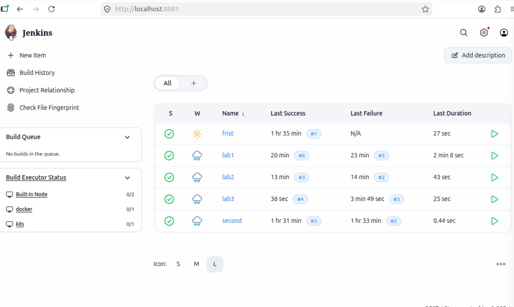

# Jenkins Pipeline Labs

## 3 Hands-on Labs

This file explains three Jenkins Pipeline labs:

1. Lab 1 — Build on EC2 Agent
2. Lab 2 — Environment Variables Pipeline
3. Lab 3 — Parameters + Manual Approval

These labs cover important Jenkins CI/CD concepts such as Jenkins agents, labels, environment variables, parameters, conditional stages, and manual approval before production deployment.

---

## Repository

My repository:

https://github.com/ahmedrabe33/jenkins_labs

Original instructor repository:

https://github.com/AbdelrhmanEzzat/digi-jenkins

---

## Images Folder

Create a folder in the repository called:

images

Put the Lab 3 screenshot/image inside this folder with this name:

3lab.png

Example structure:

jenkins_labs/
├── README.md
├── Jenkinsfile
├── package.json
├── index.js
└── images/
    └── 3lab.png

To display the image in README.md, use:



If your image is JPG instead of PNG, use:


---

# Lab 1 — Build on EC2 Agent

## Objective

The goal of Lab 1 is to run a Jenkins Pipeline on a remote EC2 instance instead of running the build on the Jenkins controller/master.

In this lab, we:

- Launch an EC2 instance on AWS.
- Install Java 21 on the EC2 instance.
- Install Node.js and npm on the EC2 instance.
- Add the EC2 instance to Jenkins as an Agent.
- Give the Jenkins Agent the label `node-agent`.
- Run a Jenkins Pipeline on the EC2 Agent.
- Confirm that the build is running on the EC2 machine, not on Jenkins controller.

---

## Requirements

Before starting Lab 1, make sure you have:

- Jenkins installed and running.
- AWS account.
- Ubuntu EC2 instance.
- SSH key pair for EC2.
- Security Group allowing SSH on port 22.
- Java installed on the EC2 agent.
- Node.js and npm installed on the EC2 agent.
- Jenkins SSH credentials configured.

---

## Part A — Setup the EC2 Instance

### Step 1 — Launch EC2 Instance

From AWS Console:

EC2 → Launch Instance

Use:

- OS: Ubuntu 22.04
- Instance type: t2.micro
- Key Pair: use your existing key pair
- Security Group: allow SSH port 22

After launching the instance, wait until:

Instance State = running

Then copy the Public IP address.

---

### Step 2 — SSH into EC2

From your terminal:

```bash
ssh -i your-key.pem ubuntu@EC2_PUBLIC_IP
```

Example:

```bash
ssh -i my-key.pem ubuntu@18.117.193.78
```

---

### Step 3 — Install Java 21

Jenkins needs Java on the Agent machine to connect and run builds.

Run:

```bash
sudo apt update
sudo apt install -y openjdk-21-jdk
java -version
```

Expected result:

You should see Java 21 installed.

---

### Step 4 — Install Node.js using NVM

Node.js is required because the project uses npm install and npm test.

Run:

```bash
curl -o- https://raw.githubusercontent.com/nvm-sh/nvm/v0.40.1/install.sh | bash

export NVM_DIR="$HOME/.nvm"
[ -s "$NVM_DIR/nvm.sh" ] && . "$NVM_DIR/nvm.sh"

nvm install 24
node -v
npm -v
```

Expected result:

Node.js and npm versions should appear.

---

## Part B — Add EC2 as Jenkins Agent

### Step 1 — Add SSH Credentials in Jenkins

Go to Jenkins:

Manage Jenkins → Credentials → Global → Add Credentials

Use:

- Kind: SSH Username with private key
- Username: ubuntu
- Private Key: paste your `.pem` key content
- ID: ec2-agent-key
- Description: EC2 Agent SSH Key

---

### Step 2 — Create New Node

Go to:

Manage Jenkins → Nodes → New Node

Use:

- Node name: node-agent
- Type: Permanent Agent

Click OK.

---

### Step 3 — Configure the Node

Use this configuration:

Remote root directory:

```text
/home/ubuntu
```

Labels:

```text
node-agent
```

Launch method:

```text
Launch agents via SSH
```

Host:

```text
EC2_PUBLIC_IP
```

Credentials:

```text
ec2-agent-key
```

Host Key Verification Strategy:

```text
Non verifying Verification Strategy
```

Click Save.

Jenkins should connect to the EC2 instance and the agent should become online.

---

## Part C — Create Lab 1 Pipeline Job

Go to Jenkins:

New Item → lab1-ec2-agent → Pipeline → OK

In Pipeline section:

Definition: Pipeline script

Paste the Jenkinsfile below.

---

## Lab 1 Jenkinsfile

```groovy
pipeline {
    agent { label 'node-agent' }

    stages {
        stage('Checkout') {
            steps {
                echo 'Checking out source code...'
                git branch: 'main',
                    url: 'https://github.com/ahmedrabe33/jenkins_labs.git'
            }
        }

        stage('Install') {
            steps {
                echo 'Installing dependencies...'
                sh '''
                  export NVM_DIR="$HOME/.nvm"
                  [ -s "$NVM_DIR/nvm.sh" ] && . "$NVM_DIR/nvm.sh"
                  npm install
                '''
            }
        }

        stage('Test') {
            steps {
                echo 'Running tests...'
                sh '''
                  export NVM_DIR="$HOME/.nvm"
                  [ -s "$NVM_DIR/nvm.sh" ] && . "$NVM_DIR/nvm.sh"
                  npm test
                '''
            }
        }
    }

    post {
        always {
            cleanWs()
        }
    }
}
```

---

## Expected Result for Lab 1

After clicking Build Now, open Console Output.

You should see:

```text
Running on node-agent in /home/ubuntu/workspace/...
```

You should also see:

- Checkout stage clones the repository.
- Install stage runs npm install.
- Test stage runs npm test.
- The workspace is cleaned after the build.

The most important result is that the build runs on the EC2 Agent, not on Jenkins controller.

---

## Lab 1 Questions and Answers

### Question 1: Where did the build run?

Answer:

The build ran on the Jenkins Agent with the label:

```text
node-agent
```

We confirm this from the Console Output line:

```text
Running on node-agent
```

This means Jenkins selected the EC2 Agent because the Jenkinsfile used:

```groovy
agent { label 'node-agent' }
```

---

### Question 2: What happens if you set the wrong label in the Jenkinsfile?

Answer:

If the label in the Jenkinsfile does not match any available Jenkins agent, the pipeline will not start.

Jenkins will keep waiting and show a message like:

```text
Still waiting to schedule task
There are no nodes with the label
```

This happens because Jenkins cannot find an online agent with the required label.

Example:

If the node label is:

```text
node-agent
```

But the Jenkinsfile says:

```groovy
agent { label 'docker' }
```

Then Jenkins will wait unless there is another online agent with label `docker`.

---

### Question 3: What does cleanWs() do in the post block?

Answer:

`cleanWs()` cleans the Jenkins workspace after the build finishes.

It deletes files created or downloaded during the build, such as:

- cloned source code
- node_modules
- temporary files
- test outputs
- generated files

This is useful because it keeps the agent clean and prevents old files from affecting the next build.

---

# Lab 2 — Environment Variables Pipeline

## Objective

The goal of Lab 2 is to understand how environment variables work inside Jenkins Pipelines.

In this lab, we:

- Define variables in the `environment { }` block.
- Use custom variables like APP_NAME, ENVIRONMENT, and VERSION.
- Use Jenkins built-in variable BUILD_NUMBER.
- Generate a dynamic version number automatically.
- Use variables inside echo messages and deploy stage.
- Understand the difference between post success and post always.

---

## What Are Environment Variables?

Environment variables are values defined once and available to all stages in the pipeline.

Example:

```groovy
environment {
    APP_NAME = 'jenkins-cicd-lab'
    ENVIRONMENT = 'staging'
    VERSION = "1.0.${BUILD_NUMBER}"
}
```

This means:

- APP_NAME stores the application name.
- ENVIRONMENT stores the deployment environment.
- VERSION stores a dynamic version based on the Jenkins build number.

Jenkins also provides built-in variables such as:

- BUILD_NUMBER
- JOB_NAME
- WORKSPACE
- GIT_COMMIT
- GIT_BRANCH

---

## Part A — Create Lab 2 Pipeline Job

Go to Jenkins:

New Item → lab2-env-vars → Pipeline → OK

In Pipeline section:

Definition: Pipeline script

Paste the Jenkinsfile below.

---

## Lab 2 Jenkinsfile

```groovy
pipeline {
    agent { label 'node-agent' }

    environment {
        APP_NAME = 'jenkins-cicd-lab'
        ENVIRONMENT = 'staging'
        VERSION = "1.0.${BUILD_NUMBER}"
    }

    stages {
        stage('Checkout') {
            steps {
                echo "Building: ${APP_NAME}"
                echo "Version: ${VERSION}"
                echo "Environment: ${ENVIRONMENT}"

                git branch: 'main',
                    url: 'https://github.com/ahmedrabe33/jenkins_labs.git'
            }
        }

        stage('Install') {
            steps {
                echo 'Installing dependencies...'
                sh '''
                  export NVM_DIR="$HOME/.nvm"
                  [ -s "$NVM_DIR/nvm.sh" ] && . "$NVM_DIR/nvm.sh"
                  npm install
                '''
            }
        }

        stage('Test') {
            steps {
                echo 'Running tests...'
                sh '''
                  export NVM_DIR="$HOME/.nvm"
                  [ -s "$NVM_DIR/nvm.sh" ] && . "$NVM_DIR/nvm.sh"
                  npm test
                '''
            }
        }

        stage('Deploy') {
            steps {
                echo "Deploying ${APP_NAME} v${VERSION} to ${ENVIRONMENT}..."
                echo 'Deploy done ✅'
            }
        }
    }

    post {
        success {
            echo "✅ ${APP_NAME} v${VERSION} deployed to ${ENVIRONMENT} successfully!"
            echo "Build #${BUILD_NUMBER} finished."
        }

        failure {
            echo "❌ Build failed for ${APP_NAME}"
        }

        always {
            echo 'Pipeline finished.'
            cleanWs()
        }
    }
}
```

---

## Expected Result for Lab 2

On Build #1:

```text
Building: jenkins-cicd-lab
Version: 1.0.1
Environment: staging
```

On Build #2:

```text
Version: 1.0.2
```

On Build #3:

```text
Version: 1.0.3
```

On Build #4:

```text
Version: 1.0.4
```

The version changes automatically because the VERSION variable uses BUILD_NUMBER:

```groovy
VERSION = "1.0.${BUILD_NUMBER}"
```

---

## Lab 2 Questions and Answers

### Question 1: What is the value of VERSION in build number 7?

Answer:

The value will be:

```text
1.0.7
```

Because the Jenkinsfile defines VERSION as:

```groovy
VERSION = "1.0.${BUILD_NUMBER}"
```

So if BUILD_NUMBER is 7, VERSION becomes 1.0.7.

---

### Question 2: What does post { success { } } do differently from post { always { } }?

Answer:

`post { success { } }` runs only when the pipeline finishes successfully.

Example:

```groovy
post {
    success {
        echo 'Build succeeded'
    }
}
```

`post { always { } }` runs every time, whether the pipeline succeeds or fails.

Example:

```groovy
post {
    always {
        cleanWs()
    }
}
```

So the difference is:

```text
success = runs only if the pipeline succeeds
always  = runs in all cases: success, failure, aborted, unstable
```

---

### Question 3: Can you use ${APP_NAME} inside a sh command? How would you write it?

Answer:

Yes, you can use `${APP_NAME}` inside a `sh` command.

Example:

```groovy
sh '''
  echo "Application name is ${APP_NAME}"
'''
```

Another example:

```groovy
sh "echo Application name is ${APP_NAME}"
```

Because APP_NAME is an environment variable, it is available inside shell commands.

---

# Lab 3 — Parameters + Manual Approval

## Objective

The goal of Lab 3 is to make the Jenkins Pipeline more flexible and reusable by using parameters and approval gates.

In this lab, we:

- Add parameters to control the pipeline at runtime.
- Choose the target deployment environment.
- Choose the version number to deploy.
- Choose whether to run tests or skip them.
- Add manual approval before production deployment.
- Use `when` conditions to skip stages.
- Use `input` to pause the pipeline before production.

---

## Parameters Used in Lab 3

| Parameter | Type | Values | Purpose |
|---|---|---|---|
| ENVIRONMENT | choice | staging / production | Choose where to deploy |
| VERSION | string | default: 1.0.0 | Choose version number |
| RUN_TESTS | booleanParam | true / false | Run or skip tests |

---

## Part A — Create Lab 3 Pipeline Job

Go to Jenkins:

New Item → lab3-parameters → Pipeline → OK

In Pipeline section:

Definition: Pipeline script

Paste the Jenkinsfile below.

Important:

The first time you save the pipeline, click:

```text
Build Now
```

After the first build, Jenkins will read the parameters block.

Then the button will change to:

```text
Build with Parameters
```

This is normal behavior.

---

## Lab 3 Jenkinsfile

```groovy
pipeline {
  agent { label 'node-agent' }

  parameters {
    choice(
      name: 'ENVIRONMENT',
      choices: ['staging', 'production'],
      description: 'Choose deploy target'
    )

    string(
      name: 'VERSION',
      defaultValue: '1.0.0',
      description: 'Version to deploy'
    )

    booleanParam(
      name: 'RUN_TESTS',
      defaultValue: true,
      description: 'Run tests before deploy?'
    )
  }

  stages {
    stage('Checkout') {
      steps {
        echo "Environment: ${params.ENVIRONMENT}"
        echo "Version:     ${params.VERSION}"
        echo "Run Tests:   ${params.RUN_TESTS}"

        git branch: 'main',
            url: 'https://github.com/ahmedrabe33/jenkins_labs.git'
      }
    }

    stage('Install') {
      steps {
        sh '''
          export NVM_DIR="$HOME/.nvm"
          [ -s "$NVM_DIR/nvm.sh" ] && . "$NVM_DIR/nvm.sh"
          npm install
        '''
      }
    }

    stage('Test') {
      when {
        expression { params.RUN_TESTS == true }
      }

      steps {
        sh '''
          export NVM_DIR="$HOME/.nvm"
          [ -s "$NVM_DIR/nvm.sh" ] && . "$NVM_DIR/nvm.sh"
          npm test
        '''
      }
    }

    stage('Approval') {
      when {
        expression { params.ENVIRONMENT == 'production' }
      }

      steps {
        input message: "Deploy v${params.VERSION} to PRODUCTION?",
              ok: 'Yes, Deploy!'
      }
    }

    stage('Deploy') {
      steps {
        echo "Deploying v${params.VERSION} to ${params.ENVIRONMENT}..."
        echo "✅ Deploy done!"
      }
    }
  }

  post {
    success {
      echo "✅ Done!"
    }

    failure {
      echo "❌ Failed!"
    }

    always {
      cleanWs()
    }
  }
}
```

---

## Optional Lab 3 Jenkinsfile Using Docker Label

If your Jenkins Agent label is `docker` instead of `node-agent`, use this first line:

```groovy
agent { label 'docker' }
```

Instead of:

```groovy
agent { label 'node-agent' }
```

Full start will be:

```groovy
pipeline {
  agent { label 'docker' }

  parameters {
    choice(
      name: 'ENVIRONMENT',
      choices: ['staging', 'production'],
      description: 'Choose deploy target'
    )

    string(
      name: 'VERSION',
      defaultValue: '1.0.0',
      description: 'Version to deploy'
    )

    booleanParam(
      name: 'RUN_TESTS',
      defaultValue: true,
      description: 'Run tests before deploy?'
    )
  }

  stages {
    stage('Checkout') {
      steps {
        echo "Environment: ${params.ENVIRONMENT}"
        echo "Version:     ${params.VERSION}"
        echo "Run Tests:   ${params.RUN_TESTS}"

        git branch: 'main',
            url: 'https://github.com/ahmedrabe33/jenkins_labs.git'
      }
    }

    stage('Install') {
      steps {
        sh '''
          export NVM_DIR="$HOME/.nvm"
          [ -s "$NVM_DIR/nvm.sh" ] && . "$NVM_DIR/nvm.sh"
          npm install
        '''
      }
    }

    stage('Test') {
      when {
        expression { params.RUN_TESTS == true }
      }

      steps {
        sh '''
          export NVM_DIR="$HOME/.nvm"
          [ -s "$NVM_DIR/nvm.sh" ] && . "$NVM_DIR/nvm.sh"
          npm test
        '''
      }
    }

    stage('Approval') {
      when {
        expression { params.ENVIRONMENT == 'production' }
      }

      steps {
        input message: "Deploy v${params.VERSION} to PRODUCTION?",
              ok: 'Yes, Deploy!'
      }
    }

    stage('Deploy') {
      steps {
        echo "Deploying v${params.VERSION} to ${params.ENVIRONMENT}..."
        echo "✅ Deploy done!"
      }
    }
  }

  post {
    success {
      echo "✅ Done!"
    }

    failure {
      echo "❌ Failed!"
    }

    always {
      cleanWs()
    }
  }
}
```

---

## Lab 3 Test Scenarios

### Scenario 1 — Staging with Tests

Use:

```text
ENVIRONMENT = staging
VERSION = 2.0.0
RUN_TESTS = true
```

Expected stages:

```text
Checkout → Install → Test → Deploy
```

Approval is not required.

---

### Scenario 2 — Staging without Tests

Use:

```text
ENVIRONMENT = staging
VERSION = 2.0.0
RUN_TESTS = false
```

Expected stages:

```text
Checkout → Install → Deploy
```

The Test stage will be skipped because RUN_TESTS is false.

Expected message:

```text
Stage "Test" skipped due to when condition
```

---

### Scenario 3 — Production with Tests

Use:

```text
ENVIRONMENT = production
VERSION = 3.0.0
RUN_TESTS = true
```

Expected stages:

```text
Checkout → Install → Test → Approval → Deploy
```

The pipeline will pause at the Approval stage.

To continue, open the running build and click:

```text
Yes, Deploy!
```

---

### Scenario 4 — Production without Tests

Use:

```text
ENVIRONMENT = production
VERSION = 3.0.0
RUN_TESTS = false
```

Expected stages:

```text
Checkout → Install → Approval → Deploy
```

The Test stage will be skipped, but Approval will still appear because the environment is production.

---

## Lab 3 Questions and Answers

### Question 1: What is the difference between `when` and `input` in a Jenkins Pipeline?

Answer:

`when` is used to decide whether a stage should run or be skipped.

Example:

```groovy
when {
    expression { params.RUN_TESTS == true }
}
```

This means the Test stage will only run when RUN_TESTS is true.

`input` is used to pause the pipeline and wait for manual approval from a user.

Example:

```groovy
input message: "Deploy to production?", ok: "Yes, Deploy!"
```

So the simple difference is:

```text
when  = controls if a stage runs or gets skipped
input = pauses the pipeline and waits for manual approval
```

---

### Question 2: What happens to the Approval stage when ENVIRONMENT = staging?

Answer:

The Approval stage is skipped.

This happens because the Approval stage has this condition:

```groovy
when {
    expression { params.ENVIRONMENT == 'production' }
}
```

So Jenkins only runs the Approval stage when the selected environment is production.

If ENVIRONMENT is staging, Jenkins skips the Approval stage and goes directly to Deploy.

---

### Question 3: How do parameters make a pipeline more reusable?

Answer:

Parameters make the pipeline reusable because they allow the user to change the pipeline behavior without editing the Jenkinsfile.

For example, with parameters, the same Jenkinsfile can be used to:

- Deploy to staging.
- Deploy to production.
- Deploy version 1.0.0.
- Deploy version 2.0.0.
- Run tests before deploy.
- Skip tests when needed.

This makes the pipeline flexible, reusable, and easier to manage.

Without parameters, we would need to edit the Jenkinsfile every time we want to change the environment, version, or test behavior.

---

### Question 4: In which stage does the pipeline pause for production? Why is this useful?

Answer:

The pipeline pauses in the Approval stage.

This is useful because production deployment is sensitive and risky.

Manual approval helps prevent accidental deployments to production.

It gives a human the chance to review the deployment before allowing it to continue.

This is a common real-world DevOps practice because production environments should be protected.

---

# Final Labs Summary

| Lab | Key Concept | Jenkins Feature | Skill Gained |
|---|---|---|---|
| Lab 1 | EC2 Agent | agent { label 'node-agent' } | Run builds on a remote EC2 machine |
| Lab 2 | Environment Variables | environment { } and BUILD_NUMBER | Track app versions automatically |
| Lab 3 | Parameters + Approval | parameters { }, when, input | Control pipeline behavior at runtime |

---

# Common Issues and Fixes

## Issue 1 — Jenkins says there are no nodes with the label

Message:

```text
Still waiting to schedule task
There are no nodes with the label 'node-agent'
```

Fix:

Go to:

Manage Jenkins → Nodes → Your Agent → Configure → Labels

Make sure the label matches the Jenkinsfile exactly.

Example:

```text
node-agent
```

Or if your Jenkinsfile uses docker:

```text
docker
```

---

## Issue 2 — npm command not found

Reason:

Node.js might be installed using NVM, but Jenkins shell does not automatically load NVM.

Fix:

Use this before npm commands:

```bash
export NVM_DIR="$HOME/.nvm"
[ -s "$NVM_DIR/nvm.sh" ] && . "$NVM_DIR/nvm.sh"
```

Example:

```groovy
sh '''
  export NVM_DIR="$HOME/.nvm"
  [ -s "$NVM_DIR/nvm.sh" ] && . "$NVM_DIR/nvm.sh"
  npm install
'''
```

---

## Issue 3 — Git checkout fails

Possible reasons:

- Wrong repository URL.
- Wrong branch name.
- Private repository without credentials.

Fix:

Make sure the repository URL is correct:

```text
https://github.com/ahmedrabe33/jenkins_labs.git
```

Make sure the branch is correct:

```text
main
```

If the repository is private, add GitHub credentials in Jenkins and use credentialsId.

Example:

```groovy
git branch: 'main',
    credentialsId: 'github-token',
    url: 'https://github.com/ahmedrabe33/jenkins_labs.git'
```

---

## Issue 4 — Production approval does not appear

Reason:

You probably selected:

```text
ENVIRONMENT = staging
```

The Approval stage only appears when:

```text
ENVIRONMENT = production
```

Because the Jenkinsfile has:

```groovy
when {
    expression { params.ENVIRONMENT == 'production' }
}
```

---

# Conclusion

These three labs demonstrate important Jenkins Pipeline concepts:

- Using Jenkins Agents to run builds on remote machines.
- Using labels to select where the pipeline should run.
- Using environment variables to avoid hardcoding values.
- Using BUILD_NUMBER to generate automatic versions.
- Using parameters to control the pipeline at runtime.
- Using when conditions to skip stages.
- Using input approval to protect production deployment.
- Cleaning workspaces using cleanWs().

Together, these labs represent a strong foundation for Jenkins CI/CD workflows used in real-world DevOps environments.
